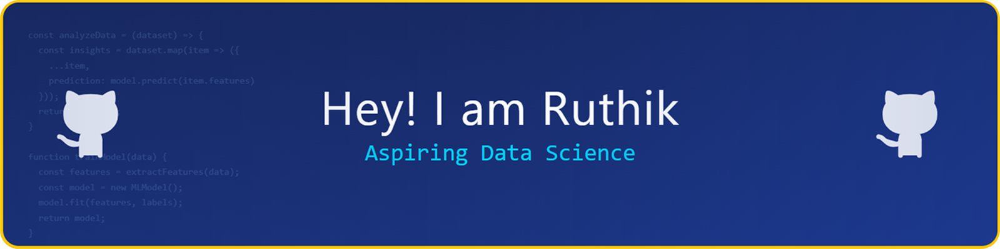

<!-- ===== HEADER BANNER ===== -->

  

<!-- ===== INTRO ===== -->

### Hi 👋 I'm Ruthik   
🎓 Computer Science student at Lovely Professional University  
📊 Interested in Data Science, UI/UX Design, Power BI, and DSA

 

 

<!-- ===== MAIN CONTENT ===== -->

## 👨‍💻 About Me
- 🎓 Computer Science student interested in **Data Science and Analytics**
- 📊 I work on **data analysis and Power BI dashboards** to extract insights
- 🎨 I enjoy creating **clean, simple, and user-friendly UI/UX designs**
- 🧠 Practicing **Data Structures & Algorithms (DSA)** to improve problem-solving
- 🌱 Currently learning **data visualization techniques and UI fundamentals**
- ⚡ I like converting raw data into clear and meaningful visuals

---

## 🛠️ Skills & Tools

  ### Languages

---

## 🚀 Projects
- 📊 **Retail Foot Traffic Analysis** – Interactive Power BI dashboard with insights  
- 🎨 **Student Academic Companion App** – UI-focused academic support application  
- 📈 **Data Analysis Projects** – Dataset exploration and visualization  
- 💻 **DSA Practice** – Problem solving using basic data structures  

---

## 📚 Currently Learning
- Advanced Power BI features  
- UI/UX design principles  
- Data storytelling and dashboards  
- Data Structures and Algorithms  

---

## 🌐 Connect with Me

  

  <!-- Gmail -->
  
  &nbsp;&nbsp;&nbsp;

  <!-- GitHub (Dark Mode) -->
  

